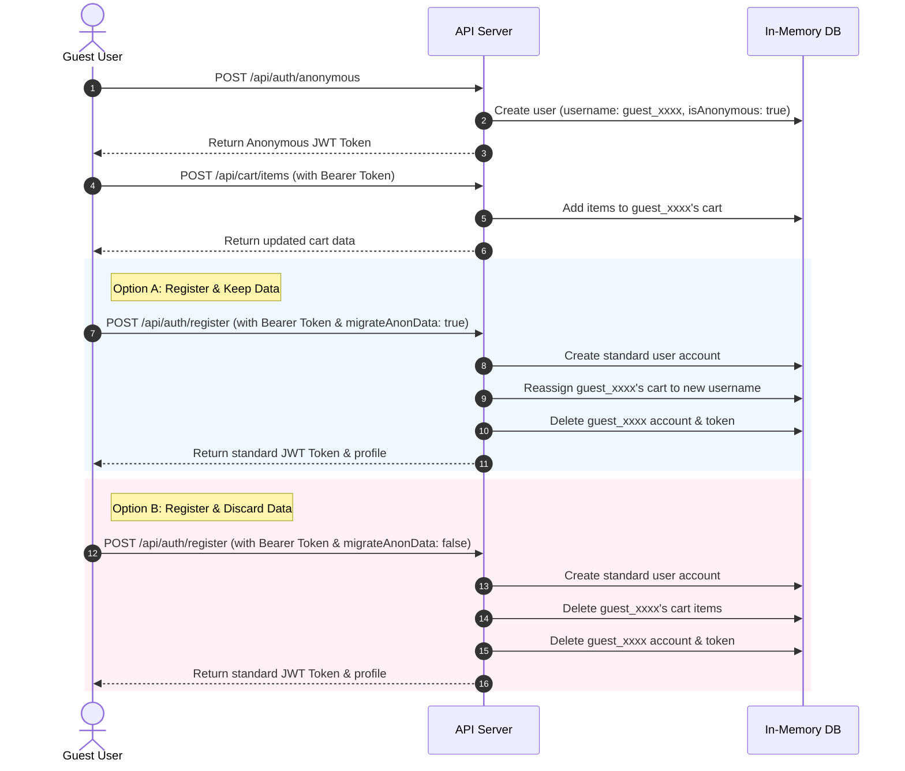

# Anonymous Authentication & Account Migration System

This document describes the design, architecture, and API endpoints for the Anonymous Authentication (Guest Sessions) and optional Account Migration system.

## Overview.

The system allows users to access shopping features (managing their shopping cart) without providing personal credentials like email or password. They can later sign up (register a normal account) and choose whether to keep their anonymous cart data or start fresh.



## API Endpoints

### 1. Anonymous Authentication
* **Endpoint:** `POST /api/auth/anonymous`
* **Description:** Initiates an anonymous guest session. No payload required.
* **Response:**
  * Status: `201 Created`
  * Body:
    ```json
    {
      "account": {
        "username": "guest_abc123",
        "isAnonymous": true
      },
      "token": "JWT_TOKEN_HERE"
    }
    ```

### 2. User Registration & Migration
* **Endpoint:** `POST /api/auth/register`
* **Headers:** `Authorization: Bearer <anonymous_jwt_token>` (Optional)
* **Payload:**
  ```json
  {
    "username": "new_user",
    "email": "user@example.com",
    "password": "SecurePassword123!",
    "migrateAnonData": true
  }
  ```
* **Description:** Registers a standard account. If an anonymous bearer token is supplied in the headers:
  * `migrateAnonData: true` will transfer the items from the anonymous session's cart to the new user's cart, then clean up (delete) the anonymous user.
  * `migrateAnonData: false` (or omitted) will delete the anonymous cart and account, registering the new user with a clean slate.

### 3. Shopping Cart CRUD
All cart endpoints require a valid JWT token (either anonymous or registered standard user) in the `Authorization` header.

* **Get Cart:** `GET /api/cart`
  * Returns the cart items, total quantity, and calculated total cost.
* **Add Cart Item:** `POST /api/cart/items`
  * Body: `{ "name": "banana", "quantity": 2 }`
  * Adds fruit items. Allowed fruits: `apple` ($1), `banana` ($2), `coconut` ($3), `mango` ($4), `grape` ($5).
* **Update Cart Item Quantity:** `PUT /api/cart/items/:name`
  * Body: `{ "quantity": 5 }`
  * Updates item quantity. If `quantity` is 0, the item is removed.
* **Remove Cart Item:** `DELETE /api/cart/items/:name`
  * Removes the fruit item entirely from the cart.
* **Clear Cart:** `DELETE /api/cart`
  * Empties the cart.

## Under the Hood Data Structures

### Account Model
Anonymous accounts are marked by `isAnonymous: true` with `email` and `password` values set to `null`.
```typescript
export interface Account {
  username: string;
  email: string | null;
  password: string | null;
  isAnonymous: boolean;
}
```

### Cart Model
Maintains active items and automatically aggregates quantities and totals.
```typescript
export interface CartItem {
  name: 'apple' | 'banana' | 'coconut' | 'mango' | 'grape';
  quantity: number;
  price: number;
  subtotal: number;
}

export interface Cart {
  ownerUsername: string;
  products: CartItem[];
  numberOfProducts: number;
  total: number;
}
```
